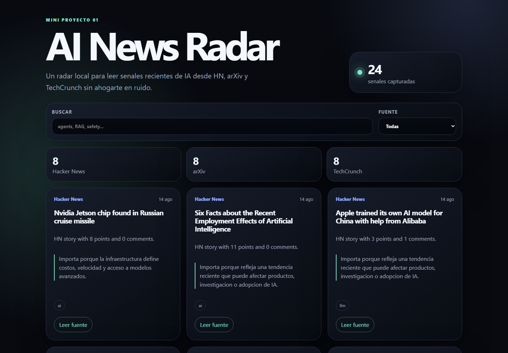

# AI News Radar

Mini-proyecto 01 del portfolio: una web local que recoge noticias de IA desde Hacker News, arXiv y TechCrunch RSS, luego genera resumenes cortos para leer rapido que esta pasando.

## Que Aprenderas

- Web scraping/API consumption con fuentes publicas.
- Resumen con LLM usando API compatible con OpenAI.
- Fallback local cuando no hay API key.
- Separacion simple entre ingesta de datos, resumen y UI.

## Fuentes

- Hacker News Algolia API.
- arXiv API.
- TechCrunch AI RSS.

## Demo



## Instalacion

```bash
npm install
```

Opcionalmente copia `.env.example` a `.env` y agrega `OPENAI_API_KEY`.

## Uso

Generar noticias:

```bash
npm run fetch
```

Levantar la web local:

```bash
npm run dev
```

Abrir:

```txt
http://localhost:4173
```

Tambien puedes ejecutar todo junto:

```bash
npm start
```

## Arquitectura

```txt
src/fetch-news.js   # obtiene noticias y guarda data/news.json
src/summarize.js    # resumen por LLM o fallback local
src/server.js       # servidor estatico local
public/             # UI web
data/news.json      # salida generada
```

## Limitaciones

- No descarga articulos completos; resume titulos, abstracts y metadatos disponibles.
- TechCrunch RSS puede cambiar formato.
- La calidad del resumen mejora si configuras una API key.

## Ideas Para Mejorar

- Agregar filtros por tema: agents, RAG, chips, research, open source.
- Guardar historico diario.
- Detectar duplicados semanticos con embeddings.
- Agregar envio por email o Telegram.
