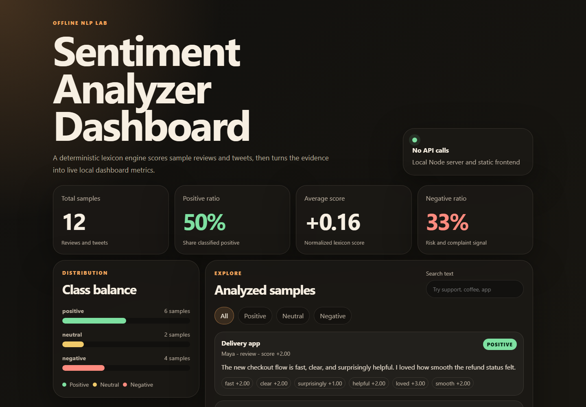

# Sentiment Analyzer Dashboard

Small offline NLP mini-project that scores sample reviews and tweets with a deterministic lexicon-based sentiment analyzer, then presents the results in a polished local dashboard served by Node.

## Demo



Screenshot placeholder only. Capture `assets/demo.png` later from the running local app.

## Features

- Offline sentiment analysis with no paid APIs and no external dependencies.
- Deterministic positive, negative, and neutral classification from a local lexicon.
- Sample reviews and tweets in `data/sample-reviews.json`.
- Summary metrics for total items, average sentiment, class counts, positive ratio, and most polarized samples.
- Responsive dashboard with accessible controls, visible focus states, and keyboard-friendly filtering.

## How It Works

Each text is tokenized, matched against weighted positive and negative terms, and adjusted for simple negation windows such as `not good` or `never helpful`. Scores are normalized by matched sentiment terms and classified using fixed thresholds.

## Run

```bash
npm start
```

Then open:

```txt
http://localhost:4111
```

## Verify

```bash
npm run verify
```

The verify command checks analyzer determinism, expected summary metrics, frontend assets, and sample data integrity.

## Project Structure

```txt
data/sample-reviews.json
public/app.js
public/index.html
public/styles.css
src/analyzer.js
src/server.js
src/verify.js
CONTEXT.md
README.md
package.json
```
