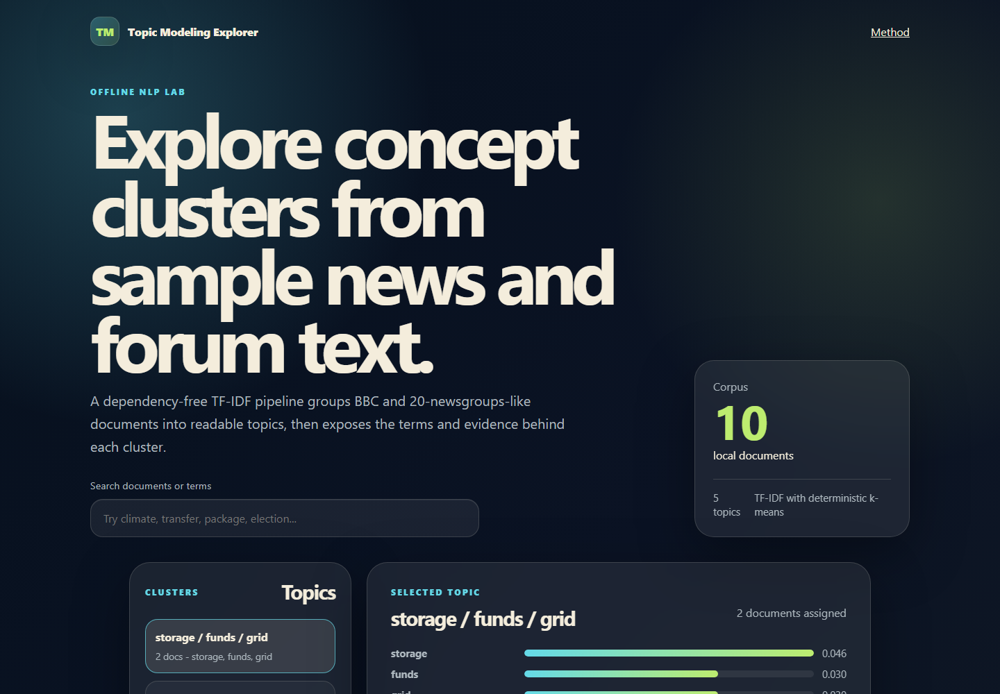

# Topic Modeling Explorer

Explorador local de clusters tematicos sobre un corpus pequeno tipo BBC y 20 Newsgroups. Genera topics, terminos representativos y documentos relacionados con TF-IDF y k-means determinista, sin dependencias externas ni red.

## Demo



La captura se agregara despues desde la app local.

## Caracteristicas

- Pipeline NLP offline con tokenizacion, stopwords, bigramas, TF-IDF y clustering.
- Topics con etiquetas, terminos principales, documentos y scores.
- Frontend local responsive con busqueda, filtros y panel de metodologia.
- Corpus editable en `sample-docs/`.
- Verificacion automatica con `npm run verify`.

## Uso

```bash
npm install
npm run build
npm run dev
```

Abrir `http://localhost:4173`.

## Verificacion

```bash
npm run verify
```

El comando regenera `public/data/topics.json`, valida estructura, clusters, documentos y prueba el servidor local.

## Estructura

```txt
sample-docs/          Corpus Markdown local
src/topic-engine.js   TF-IDF y k-means determinista
src/build-topics.js   Generador de datos para la UI
src/server.js         Servidor local sin dependencias
src/verify.js         Checks offline
public/               Frontend estatico
assets/demo.png       Screenshot esperado
```

## Metodo

Cada documento se convierte en tokens normalizados y bigramas informativos. El motor calcula TF-IDF, reduce cada documento a un vector disperso y agrupa con k-means determinista. Despues etiqueta cada cluster con los terminos TF-IDF mas representativos de sus documentos.
