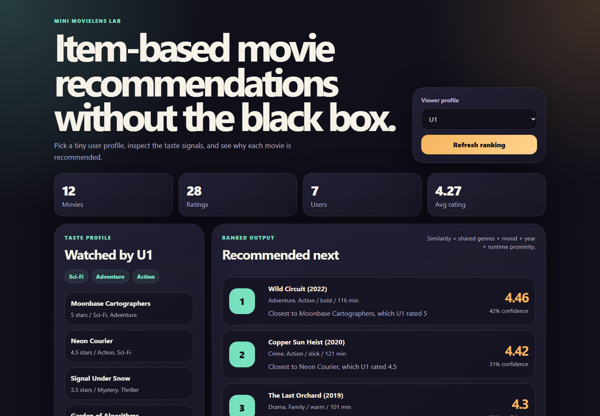

# Recommender System Lab

Mini-project 21: a tiny MovieLens-like recommender that explains item-based recommendations from a local dataset. It includes a CLI, a polished local frontend, and a verification command.

## What You Will Learn

- How item-based recommendation scores are built from similarity signals.
- How user profiles, watched items, and candidate items interact.
- How to keep a recommender explainable with tiny local data.
- How to expose the same model through a CLI and local web UI.

## Demo



Screenshot is expected at `assets/demo.png` after the local frontend is captured.

## Install

```bash
npm install
```

No external packages are required.

## Usage

Run the CLI:

```bash
npm run recommend -- --user U1 --limit 5
```

Run the local frontend:

```bash
npm run dev
```

Open:

```txt
http://localhost:42121
```

Verify the project:

```bash
npm run verify
```

## Architecture

```txt
data/movies.json       # tiny movie catalog
data/ratings.json      # tiny user-item ratings matrix
src/recommender.js     # item similarity, profile, stats, recommendations
src/cli.js             # command-line recommender
src/server.js          # local HTTP server and JSON API
src/verify.js          # deterministic verification checks
public/                # frontend HTML, CSS, and JS
reports/               # verification notes and future screenshots/reports
```

## Method

The recommender scores unseen movies for a selected user. Each candidate movie is compared with the movies the user already rated. Similarity combines shared genres, matching mood, release year proximity, and runtime proximity. The predicted score is a weighted average of the user's ratings, weighted by item similarity.

## Limitations

- The dataset is intentionally tiny and synthetic.
- It does not learn embeddings or train a model.
- Cold-start users fall back to average item rating.
- Similarity weights are hand-tuned for educational clarity.

## Ideas To Improve

- Add user-based collaborative filtering and compare rankings.
- Add evaluation metrics such as precision at K and leave-one-out testing.
- Let users create temporary ratings in the browser.
- Capture `assets/demo.png` after visual QA.
