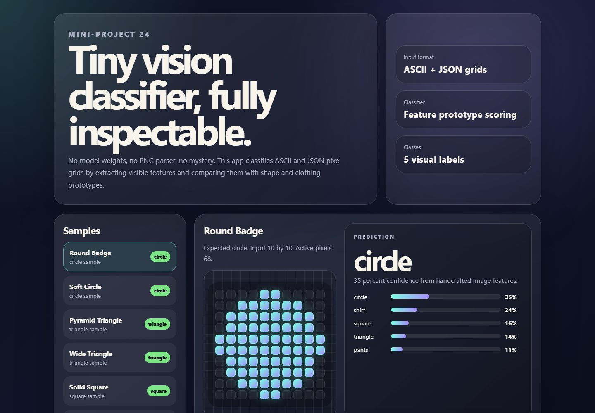

# Computer Vision Classifier

Mini-project 24 implements a tiny image-feature classifier for ASCII and JSON pixel grids. It avoids heavy ML models and PNG parsing by extracting interpretable features from small matrix samples, then classifies shape and clothing-like silhouettes.



Note: `assets/demo.png` is reserved for the screenshot capture step later.

## What It Does

- Loads labeled samples from `data/samples.json`.
- Converts ASCII grids into binary pixel matrices.
- Extracts visual features such as density, bounding box, symmetry, top/middle/bottom mass, sleeve mass, and edge concentration.
- Scores each sample against lightweight class prototypes.
- Shows predictions, confidence, feature bars, confusion summary, and sample inspection in a polished frontend.

## Classes

- `circle`: round compact object with symmetric mass.
- `triangle`: bottom-heavy object with narrow top.
- `square`: dense rectangular object with stable width.
- `shirt`: clothing-like silhouette with sleeves and torso.
- `pants`: clothing-like silhouette with two separated legs.

## Run

```bash
npm run dev
```

Open `http://localhost:4324`.

## Verify

```bash
npm run verify
```

The verification checks dataset shape, classifier accuracy on bundled samples, JSON matrix support, and required project files.

## Project Layout

```text
staging/24-computer-vision-classifier/
  public/index.html
  src/app.js
  src/classifier.js
  src/server.js
  src/styles.css
  src/verify.js
  data/samples.json
  assets/demo.png
  reports/verification.md
  README.md
  CONTEXT.md
```

## Design Notes

The UI is intentionally model-inspection focused: the user can select a sample, inspect its pixel grid, compare top predictions, and see which handcrafted visual features influenced the result. This keeps the project honest about its tiny classifier while still feeling like a computer vision tool.
