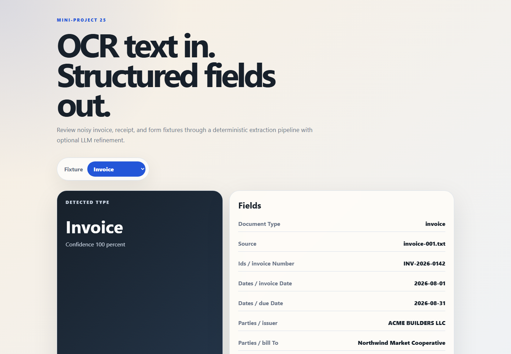

# OCR + LLM Extractor

Dependency-free mini-project that turns simulated OCR text from invoices and forms into structured JSON or Markdown.



## What It Does

- Reads OCR-like `.txt` fixtures from `fixtures/data`.
- Detects document type: invoice, form, receipt, or generic document.
- Extracts fields with deterministic rules: document IDs, dates, totals, vendors, patients/customers, emails, phones, tax, addresses, and line items.
- Optionally sends the rule-based result to an LLM endpoint for refinement.
- Writes JSON or Markdown reports to `reports`.
- Serves a polished static frontend for fixture review.

## Requirements

- Node.js 20 or newer.
- No npm dependencies.

## Quick Start

```bash
npm run verify
```

Generate JSON:

```bash
npm run extract -- --input fixtures/data/invoice-001.txt --format json --out reports/invoice-001.json
```

Generate Markdown:

```bash
npm run extract -- --input fixtures/data/form-intake-001.txt --format markdown --out reports/form-intake-001.md
```

Run the frontend:

```bash
npm run serve
```

Open `http://localhost:4325`.

## CLI

```bash
node src/cli.js --input fixtures/data/receipt-001.txt --format json
```

Options:

- `--input <path>`: OCR text fixture to parse.
- `--format json|markdown`: output format. Default: `json`.
- `--out <path>`: output file. If omitted, writes to stdout.
- `--use-llm`: enables optional LLM refinement if environment variables are present.

## Optional LLM Refinement

Rule extraction is the default and works offline. To add an LLM refinement pass, set these environment variables:

- `OCR_LLM_ENDPOINT`: HTTP endpoint that accepts a JSON POST body.
- `OCR_LLM_API_KEY`: optional bearer token.
- `OCR_LLM_MODEL`: optional model name, default `local-refiner`.
- `OCR_LLM_TIMEOUT_MS`: optional timeout, default `12000`.

The request body contains:

```json
{
  "model": "local-refiner",
  "instruction": "Refine extracted OCR fields...",
  "ocrText": "...",
  "extracted": {}
}
```

The endpoint should return either a JSON object or `{ "fields": { ... } }`. If the request fails, the CLI keeps the rule-based result and records the LLM error in metadata.

## Fixtures

- `fixtures/data/invoice-001.txt`: contractor invoice.
- `fixtures/data/form-intake-001.txt`: medical intake form.
- `fixtures/data/receipt-001.txt`: retail receipt.

## Reports

Sample reports are committed under `reports` and can be regenerated with `npm run verify`.

## Verify Command

```bash
npm run verify
```

The verification script extracts all fixtures, checks required fields, writes sample reports, and fails non-zero if extraction quality regresses.
